# Azure-SensitiveAnalysis-Learning

Este repositório contém uma análise exploratória de avaliações de clientes de uma cafeteria fictícia. Utilizando as ferramentas do **Azure Portal**, o objetivo é realizar a ingestão, processamento e visualização dos dados para identificar padrões e insights.

## Ferramentas Utilizadas

- **[Azure AI + Machine Learning](https://azure.microsoft.com/en-us/services/machine-learning/)**: Especificamente o **[Serviço de Linguagem](https://azure.microsoft.com/en-us/services/cognitive-services/text-analytics/)**, usado para análise de sentimento das avaliações.

## Objetivos do Projeto

Demonstrar como utilizar os serviços do Azure, em particular o Serviço de Linguagem, para análise de sentimento de avaliações de clientes de uma cafeteria, identificando áreas de melhoria na experiência do cliente e qualidade dos produtos oferecidos.

## Dataset

O projeto utiliza um pequeno dataset contendo avaliações de clientes sobre diferentes tipos de bebidas. Cada avaliação inclui o tipo de bebida e o comentário do cliente. Aqui está um exemplo dos dados:

| Tipo de Bebida | Comentário                      |
| -------------- | ------------------------------- |
| Latte          | "Sabor maravilhoso!"            |
| Cappuccino     | "Muito quente, quase queimei a língua." |

## Processamento de Dados

O Serviço de Linguagem do Azure é utilizado para realizar a análise de sentimento de cada avaliação. O serviço retorna a pontuação de sentimento (positivo, neutro ou negativo) e a confiança associada.

## Resultados da Análise de Sentimento

A análise de sentimento das avaliações processadas revela os seguintes insights:

* **Sentimento Geral:** Predominantemente positivo, mas com alguns comentários negativos e neutros que merecem atenção.
* **Principais Pontos Positivos:** "Sabor maravilhoso", "Perfeito para a manhã", "Melhor bebida que já experimentei", "Qualidade do leite excelente".
* **Principais Pontos Negativos:** "Café amargo demais", "Espuma rala", "Muito quente, quase queimei a língua".
* **Sugestão de Melhoria:** A recorrência do comentário "Refrescante, mas poderia ser mais doce" sugere a necessidade de avaliar o nível de açúcar oferecido como padrão para algumas bebidas.

### **Distribuição Geral dos Sentimentos**
| Sentimento  | Quantidade | Percentual (%) |
| ------------|------------|----------------|
| Positivo    | 73         | 79.35%         |
| Neutro      | 1          | 1.09%          |
| Negativo    | 18         | 19.56%         |
| **Total**   | 92         | 100%           |

### **Sentimento por Tipo de Bebida**
| Bebida         | Positivo | Neutro | Negativo | Total |
| ---------------| ---------|------- | --------|-------|
| Flat White     | 7        | 0      | 3       | 10    |
| Frappuccino    | 8        | 0      | 3       | 11    |
| Macchiato      | 6        | 0      | 1       | 7     |
| Café Gelado    | 6        | 0      | 0       | 6     |
| Latte          | 7        | 0      | 2       | 9     |
| Cappuccino     | 7        | 0      | 1       | 8     |
| Café Expresso  | 3        | 1      | 4       | 8     |
| Americano      | 5        | 0      | 3       | 8     |
| Café com Leite | 5        | 0      | 2       | 7     |
| Mocha          | 4        | 0      | 2       | 6     |

---

### **Gráfico de Barras - Sentimento por Tipo de Bebida**

```mermaid
---
config:
    xyChart:
        chartOrientation: 'horizontal'
        margin:
            bottom: 100
            right: 100
---
xychart-beta
    title "Sentimentos por Tipo de Bebida"
    x-axis ["Flat White", "Frappuccino", "Macchiato", "Café Gelado", "Latte", "Cappuccino", "Café Expresso", "Americano", "Café com Leite", "Mocha"]
    y-axis "Quantidade"
    bar "Positivo" [7, 8, 6, 6, 7, 7, 3, 5, 5, 4]
    bar "Neutro" [0, 0, 0, 0, 0, 0, 1, 0, 0, 0]
    bar "Negativo" [3, 3, 1, 0, 2, 1, 4, 3, 2, 2]
```

### **Insights da Análise**
1. **Alta aceitação geral**: 79,35% das avaliações são positivas.
2. **Bebida mais bem avaliada**: "Frappuccino" lidera em avaliações positivas (8).
3. **Bebida com mais avaliações negativas**: "Café Expresso" teve 4 avaliações negativas, principalmente devido à espuma rala.
4. **Bebida com maior equilíbrio**: "Americano" teve tanto avaliações positivas quanto negativas.
5. **Reclamações frequentes**:
   - "Muito quente, quase queimei a língua."
   - "O café estava amargo demais para o meu gosto."
   - "A espuma estava rala."

### **Conclusão**.
A análise revela que a maioria das bebidas recebeu avaliações positivas, especialmente o "Frappuccino" e "Macchiato". No entanto, bebidas como "Café Expresso" e "Americano" tiveram críticas mais equilibradas, indicando áreas para potencial melhoria.

## Prints dos Resultados

*tenho que Adicionar aqui os prints*

## Como Executar o Projeto

### Pré-requisitos:

* Conta no **Azure**.
* Acesso ao **Azure Portal**.
* Recurso do **Serviço de Linguagem** criado no Azure.
* Dataset de avaliações.

### Passos:

1. Faça o login no **Azure Portal**.
2. Acesse o recurso do **Serviço de Linguagem**.
3. Utilize a API de Análise de Sentimento do Serviço de Linguagem para processar o dataset.

## Licença
Este projeto está licenciado sob a [MIT License](LICENSE).
